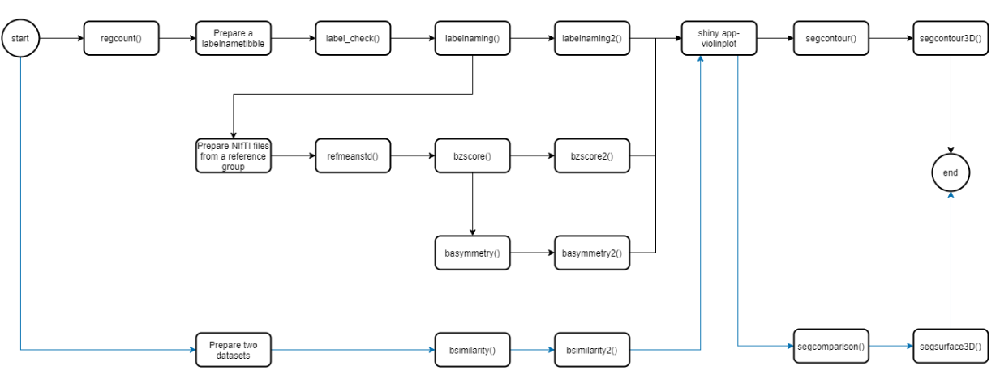

# IKUB

IKUB is an R package for region-based analysis of MRI brain images, integrating:

- Statistical analysis
- Image visualization (2D / 3D)
- Data visualization (Shiny app)

All in **one unified workflow**.

## Features

- Region-wise volume & voxel counts
- Z-score computation (population-based)
- Brain asymmetry analysis
- Segmentation comparison
- Dice coefficient
- Jaccard index
- 2D / 3D visualization of brain structures
- Interactive violin plots via Shiny

## Input

- MRI data in NIfTI format (.nii, .nii.gz)
- Segmentation label files

## Quick Example
```
# Volume analysis
regcount("a01-seg.nii.gz")

# Add anatomical labels
labelnaming(files, label_table)

# Compute z-scores
ref <- refmeanstd(files)
bzscore(files, label_table, ref)
```
## Visualization

Use the built-in Shiny app:

https://alisonhyp.shinyapps.io/shiny_violinplot/

- Violin + box plots

- Outlier detection

- Customizable display

## Workflow

- IKUB supports four main pipelines:
- Volume analysis
- Statistical normalization (z-score)
- Asymmetry analysis
- Segmentation comparison

Each step is modular and composable.
## Project Function Workflow
This section contains a flowchart that visualizes the usage and interaction of all functions in the project.


## Installation
```
install.packages("devtools")
devtools::install_github("xhhse/IKUB")
```
## Use Cases
- Neuroimaging research
- Brain volumetry
- Disease analysis (e.g. Alzheimer’s, MS)
- Segmentation evaluation

## Citation

Yu-Ping Hsu (2021)
Region-based analysis of magnetic resonance brain images
